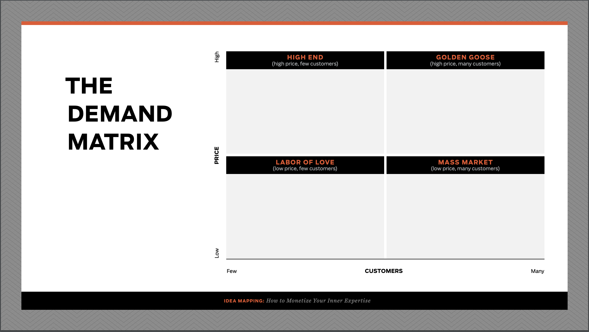

When you're ready to take on a new project, to start a new business, you're starting with a blank page. Blank pages are freedom.

But with freedom comes decisions. A lot of decisions.

I enjoy this - but I want a process, a system, to guide me so that I stay consistent and check all the boxes.

Ramit Sethi describes this as building your playbook in his _Zero to Launch_ course (which has been replaced by _[Earnable](https://buy.iwillteachyoutoberich.com/earnable/))_. A playbook that tells you what to do next, even when you're in the weeds and decisions seem hard to make.

This living document intends to be the Handlebar Labs playbook on analyzing and choosing the next software project we take on.

## Deciding to Start a New Project

The first step is deciding to take on a new project. Do you realistically have the time to take on a new project? Have you recently:

- Sold a previous project?
- Hired yourself out of the project (replaced yourself)?
- Automated a project to the point where you've got free time?
- Quit/sunset a project?

If yes, continue.

## Brainstorming Audiences/Niches

It's easy to fall into the trap of thinking of a product, starting to build it, and then finding an audience.

This is backwards.

Arvid Kahl talks about this in his book [Zero to Sold](https://thebootstrappedfounder.com/zero-to-sold/).

The right path is to find an audience/niche. Learn what their critical problem is. Develop a solution. Build that solution.

To brainstorm ideas follow [Ramit Sethi's Idea Mapping](https://growthlab.com/my-checklist-for-finding-a-profitable-business-idea/) process.

This is the time to get ideas out without any filtering. Reference lists you've been keeping. Ask yourself the following questions:

- What are you good at?
- What do other people struggle with that you're good at? What do people compliment you on?
- What are you interested in? Where do you spend your time?
- Who do you want to work with? Who do you want to be customers/partners?

At Handlebar Labs we primarily focus on building software that helps people do their primary job easier, faster, and with more focus. We want to remove friction points so that they can focus on doing what they do best.

Example Industry/Niche: Vehicle Upfitters.

## Organizing Thoughts

Again looking back at Ramit's Idea Mapping process we can organize our ideas into a demand matrix.

Each quadrant is valid... it just depends on what you want to get out of.

Most interested in money? The "Golden Goose" category is where you want to be.

Influence as many people as possible? "Mass Market" may be your spot.

Do you want one on one interaction? "High End".

Help a group you know needs help but doesn't have the money/isn't willing to pay? "Labor of Love".

It all depends on what _you_ want out of this.

At this point we can choose an audience/niche to start pursuing.

## Niching Down

In _Zero to Sold_ Arvid does a great job of discussing the power of a niche. It's got a built in network effect and lets you build a really good product without having to build a really big product.

So, niche down to a point that you feel the audience/niche could support you and a couple other competitors.

Figuring out if a niche can support you depends on what your goals/needs are from this project. How much money do you need/want to make from it? What impact do you want to have?

Once you know you can start the art of research. Ideas for research:

- Where do the professionals in these industries hang out online? How many are there? How many unique companies?
- Who are some industry experts?
- Who are the local companies serving this industry?

Example: Vehicle Upfitters → Overland Vehicle Upfitters.

## Critical Problem Research

When you were niching down you should have found a variety of places to gather information.

Now is the hard part.

Wait.

Consume.

Participate.

Learn.

Research.

What are issues that you see coming up? How are people solving them?

What do they _have to do_ that they dislike doing? How are they managing it now?

What do they already pay for? What do they dislike about it?

How do they make money? How can you help them do that easier?

This is an art. You need to start to really become part of the niche to get a good sense of what is needed.

## Solution Development

Once you've identified the critical problem you can start to develop a solution that you will, soon, turn into a product.

Start with how people are already solving that problem.

What do they like about their solution?

What don't they like?

Do you know of a way that it can be done easier?
